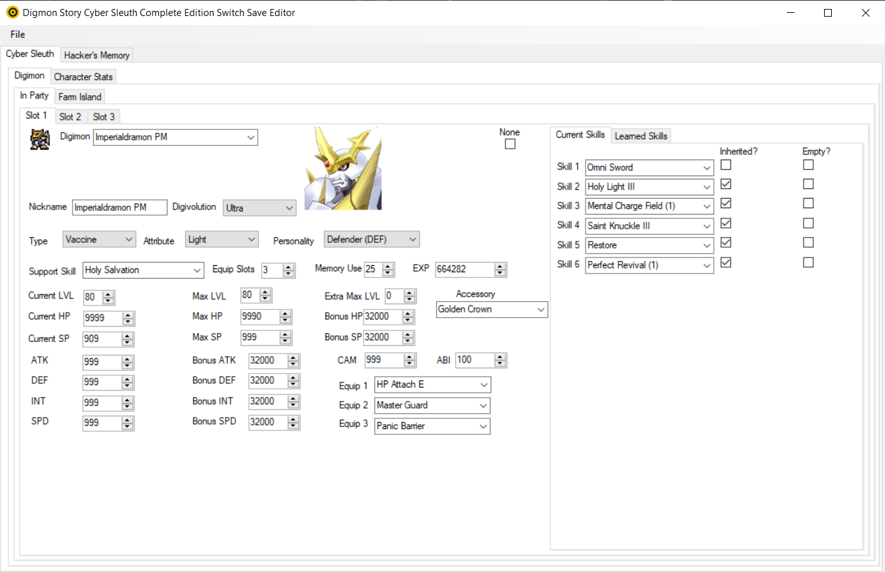

# Digimon-Story-Cyber-Sleuth-Complete-Edition-Save-Editor
For Switch version only!



Note: The original creator of this save editor has given their blessing for me to continue development of this save editor.

Work in progress. I am editing the code outside of GitHub on my PC, so even though updates to GitHub are sparse, work is steadily continuing regardless.

The following is a description of the editor from the original creator, @GreenMii :

```
I decided to write this program just to see if I could and also because as far as I'm aware,
there isn't a save editor for this game out there. This was made using the very limited C#
knowledge I gained from one semester of college and lots of Googling, so expect the code to be
extremely unoptimized. Hopefully someone out there will see this mess and decide to make
something better of it :)  If not, I'll probably keep working on it until I'm happy with the
features.
```

# Original Credits
```
Huge thanks to these folks at GBAtemp: AnalogMan for data research and awesome script, omega7 for data research, supermariorick and ukee for the Edizon script and data research.

Also thanks to DrummerIX on FearLess Cheat Engine for the cheat table that I cross-referenced and segamot and dd777 for updating it with more stats.

Big thanks to digidb.io from which I got all the Digimon portraits.

Finally, shoutouts to Snodeca for her Dream Team save editor that I referenced when making this one!
```

## Additional Credits:
```
Thanks to GreenMii for laying the ground work, and JoelCoehoorn on StackOverflow for the help refactoring a function that was causing longer than desired load times. Also thanks to Draken70 at GameFAQs for the awesome walkthrough for the first game that in particular had a (mostly correct) rank up table to reference.
```
